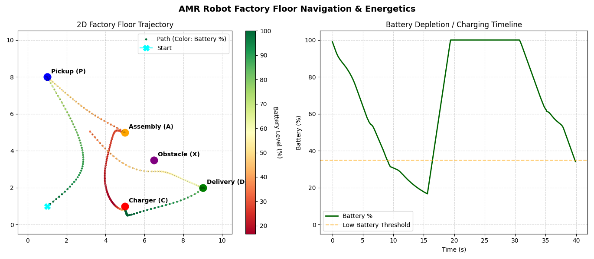
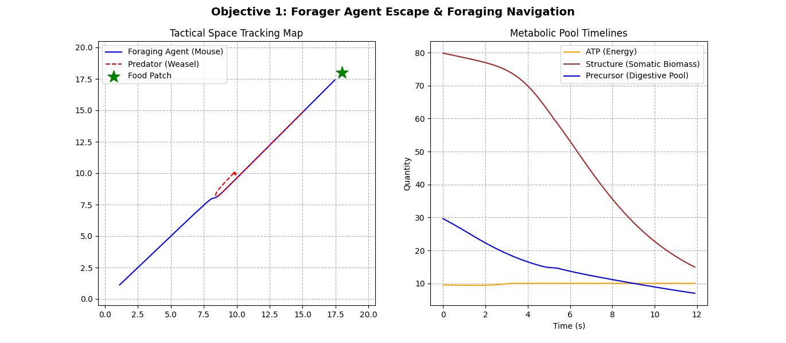
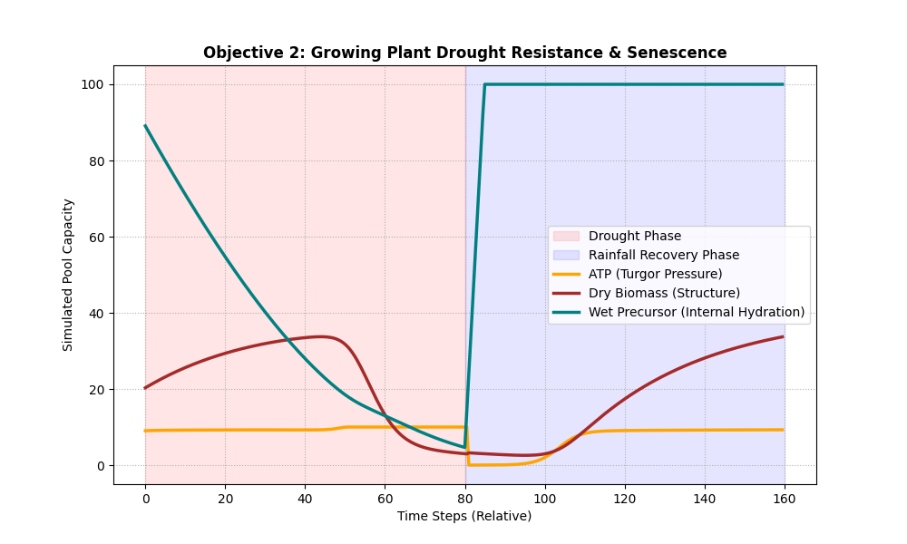
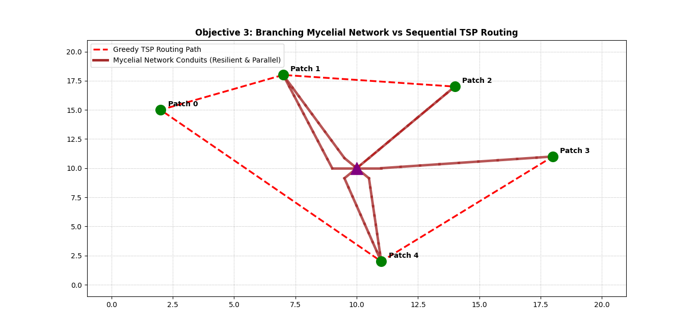
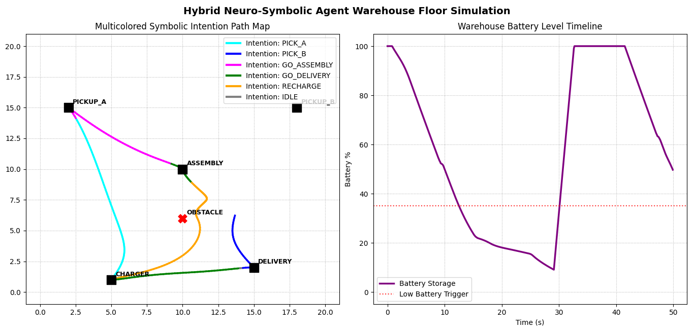

# Bounded Autopoietic Control via the CDF v2-UL Agent Compiler

[](https://doi.org/10.5281/zenodo.20779120)
[](https://opensource.org/licenses/MIT)
[](https://www.python.org/downloads/)

## What is the CDF v2-UL Agent Compiler?

Most autonomous control frameworks (like traditional robotics or game AI) rely on complex, computationally heavy "active boundaries" or custom code constraints to prevent virtual agents or physical robots from running out of battery, getting lost, or colliding with hazards. 

The **CDF v2-UL Agent Compiler** takes a different approach: **it guarantees safety and survival by construction**. 

It behaves like a software compiler:
1. **You write high-level, human-readable logic** using a simple, declarative embedded Domain-Specific Language (eDSL). You describe targets, priorities, and homeostatic needs (like hunger or battery life).
2. **The Compiler translates your logic** into a set of unconstrained continuous coordinate equations ($G$-space) and exact integration steps.
3. **The Runtime projects the behavior back** to the physical agent. Even if the agent is pushed to absolute extremes, the underlying mathematical mapping ensures it is physically impossible for its metabolic pools (battery/energy) to collapse or exceed physical limits.

No complex active monitoring, safety handlers, or custom safety-override code are required. Safety and survival are woven directly into the coordinate geometry of the environment.

---

## Mini-Tutorial: Building an Agent in 4 Steps (No Math Required)

You do not need to understand advanced calculus, Lambert $W$ functions, or differential geometry to use this framework. The eDSL abstracts the entire mathematical compiler behind a simple, intuitive Python API.

Here is how you program a self-preserving warehouse robot in just a few lines of code:

### Step 1: Define the Spatial Environment
First, define the physical landmarks on the factory floor. Targets can pull the agent in (`ATTRACTIVE`) or push it away (`REPULSIVE`).

```python
from compiler.dsl import SpatialTarget

# A delivery bay at coordinate [15, 2] that pulls the robot in
delivery_bay = SpatialTarget("delivery", coords=[15.0, 2.0], behavior="ATTRACTIVE", gain=2.5)

# A charging dock at coordinate [5, 1]
charging_dock = SpatialTarget("charger", coords=[5.0, 1.0], behavior="ATTRACTIVE", gain=2.5)

# A hazard at coordinate [10, 6] that repels the robot
hazard_zone = SpatialTarget("obstacle", coords=[10.0, 6.0], behavior="REPULSIVE", influence_radius=1.8, gain=3.5)
```

### Step 2: Connect Targets to Action Drives
Next, define the agent's decision-making channels. A `Drive` connects a physical target to a baseline importance (priority).

```python
from compiler.dsl import Drive

# Cognitive drives are planned and can be inhibited by other priorities
go_deliver = Drive("deliver_drive", target=delivery_bay, gating_type="COGNITIVE", default_priority=4.0)

# Reactive drives are reflexive (for safety, urgency, and emergency actions)
go_charge = Drive("recharge_drive", target=charging_dock, gating_type="REACTIVE", default_priority=0.5)
avoid_hazard = Drive("avoid_obstacle", target=hazard_zone, gating_type="REACTIVE", default_priority=4.5)
```

### Step 3: Wire Up Homeostatic Needs (Feedback Loops)
You want the robot to prioritize charging when its battery drops. A `FeedbackLoop` automatically monitors an internal state (like `"battery"`) and dynamically boosts the priority of a drive if that state gets low.

```python
from compiler.dsl import FeedbackLoop

# If the "battery" pool drops below 35%, inject a priority bias of up to +25.0 to 'go_charge'
battery_safety_loop = FeedbackLoop(
    source_pool_name="battery",
    target_drive=go_charge,
    threshold=35.0,
    gain=0.18,
    max_bias=25.0,
    response_direction="INVERSE" # Low battery causes high drive priority
)
```

### Step 4: Assemble the Mission State Machine
Finally, package the active workflow inside a simple state machine. The compiler handles the rest.

```python
from compiler.dsl import State, StateMachine
from compiler.core import CDFCompilerEngine

# Setup a cyclical mission: deliver goods, then return to idle/recharge
mission = StateMachine(start_state="DELIVER_GOODS")
mission.add_state("DELIVER_GOODS", State(drive=go_deliver, on_reach="RETURN_TO_DOCK"))
mission.add_state("RETURN_TO_DOCK", State(drive=go_charge, on_reach="DELIVER_GOODS"))

# Create and compile your engine
engine = CDFCompilerEngine(mission=mission, bounds=(np.array([0.0, 0.0]), np.array([20.0, 20.0])))
engine.register_background_drive(avoid_hazard) # Always avoid obstacles, regardless of current mission state
engine.register_feedback_loop(battery_safety_loop)

engine.compile_environment()
```

When you call `engine.step()`, the compiler runs the exact G-space conversions, resolves the lateral-inhibition competitive gating networks, and updates the robot's coordinates smoothly—leaving you with clean, reliable, and safely bounded agent control.

---

###For Advanced Uses

The implementation of the **Coordinate-Driven Forcing version 2 Ultra-Linearization (CDF v2-UL)** Agent Compiler. This framework bridges high-level symbolic logic and continuous task-space state machines (System 2) with autonomic, physiologically-constrained metabolic dynamics (System 1). By performing diffeomorphic mapping ($\Phi$) of physically bounded environments into unconstrained virtual $G$-spaces, solving linear dynamics, and projecting them back via transcendental inversions ($\Phi^{-1}$), physiological and environmental safety are mathematically guaranteed by construction.

---

## 1. Mathematical Foundations

The core task of the compiler is to restrict an agent's physical physiological state vector $\mathbf{x} = [x_e, x_n, x_c]^T$ strictly inside safe boundaries without requiring active bounding controllers.

```
                  Φ(x)                      Exact Linear Step
  Physical Space -------> Virtual G-Space --------------------> New G-State
  [Constraints]           [Unconstrained]   dg/dt = r*g + f     |
        ^                                                       |
        |_______________________________________________________|
                                 Φ⁻¹(g)
                             Inverse Map
```

*   **Ratio Mapping (ATP Pool $x_e$):** Confined to the half-open interval $(0, x_{e,\max}]$ via:
    $$g_e = \Phi_e(x_e) = \frac{x_e}{x_{e,\max} - x_e} \iff x_e = \Phi_e^{-1}(g_e) = x_{e,\max} \frac{g_e}{1 + g_e}$$
*   **Saturating-Exponential Mapping (Precursor Pool $x_c$):** Governed by Michaelis-Menten-style saturation and inverted back using the principal branch of the transcendental Lambert $W$ function ($W_0$):
    $$g_c = \Phi_c(x_c) = x_c e^{\frac{x_c}{k_m}} \iff x_c = \Phi_c^{-1}(g_c) = k_m W_0\left(\frac{g_c}{k_m}\right)$$
*   **Bounded Relaxation (Structure Pool $x_n$):** Confined using a convex relaxation toward a dynamic metabolic equilibrium over timestep $\Delta t$:
    $$x_n(t+\Delta t) = x_{n,\text{eq}} + \left(x_n(t) - x_{n,\text{eq}}\right) e^{-b \Delta t}$$

---

## 2. Directory Layout

To maintain modularity and safety, the core compiler is completely separated from the experimental prototypes.

```text
root/
├── .gitignore
├── README.md
├── main.py                    # Unified Interactive Visualizer
├── assets/                    # Image assets directory
│   ├── amr_navigation.png
│   ├── forager_escape.png
│   ├── plant_drought.png
│   ├── mycelial_tsp.png
│   ├── bacteria_chemotaxis.png
│   └── symbolic_warehouse.png
├── compiler/                  # Unmodified Core Compiler Module
│   ├── __init__.py
│   ├── core.py                # Core CDF compiler step engine
│   ├── dsl.py                 # Declarative eDSL primitive structures
│   ├── gating.py              # Competitive gating mathematical models
│   └── integrator.py          # Lambert-W and closed-form G-space solver
└── prototype/                 # Concrete Experimental Paradigms
    ├── __init__.py
    ├── amr_robot_prototype.py # Factory Autonomous Mobile Robot (AMR)
    ├── bio_simulations.py     # Biological simulations (1 to 4)
    └── symbolic_ai_agent.py   # Hybrid Neuro-Symbolic Agent
```

---

## 3. Visualization Dashboard

The interactive script `main.py` provides real-time simulation, state-tracking, and visualization of the various compiler environments.

### 3.1 Autonomous Mobile Robot (AMR) Prototype
An Autonomous Mobile Robot navigates a factory floor to execute pick-up, assembly, and delivery tasks while managing its battery homeostasis and avoiding static hazards.
* **Metabolism:** Battery behaves as an energy pool drained by movement speed and recharged at the docking station.
* **Visual Representation:** The trajectory is rendered with dynamic color-coding highlighting real-time battery levels.



### 3.2 Objective 1: Forager Agent Escape & Foraging Navigation
A simulated wild rodent (*Apodemus sylvaticus*) balances metabolic energy collection against threat evasion. It initiates active escape behaviors only when the predator enters its physical detection zone.



### 3.3 Objective 2: Growing Plant Drought Resistance & Senescence
A sessile plant model (*Arabidopsis thaliana*) managing hydration and dry biomass dynamics under drought and rainfall cycles. The compiler emulates stomatal resistance, slowing water loss to protect core turgor pressure (ATP) by autopoietically degrading dry structure.



### 3.4 Objective 3: Mycelial Network vs Sequential TSP Routing
A decentralized, branching mycelial network growing from a spore origin at $(10, 10)$ toward five food sources. Edge segments are reinforced through precursor cytoplasmic flow or pruned due to starvation. This branching topology is compared against a sequential Traveling Salesperson Problem (TSP) path.



### 3.5 Objective 4: E. coli Gradient Climbing and Sensory Adaptation
An *Escherichia coli* bacterium navigating a Gaussian chemical gradient using sensory temporal adaptation (biochemical memory), mimicking chemoreceptor methylation.


### 3.6 Hybrid Neuro-Symbolic Warehouse Robot
A hybrid deliberative-reactive architecture. A high-level symbolic AI planner monitors continuous states, updates logical beliefs, selects intentions (e.g., `PICK_A`, `RECHARGE`), and dynamically transitions the active states of the underlying `StateMachine` without modifying compile-time variables.



---

## 4. Getting Started

### 4.1 Installation & Setup

Clone the repository and navigate into the project root directory:

```bash
git clone https://github.com/JPQ-exp/autopoiesis-control-cdf.git
cd autopoiesis-control-cdf

### 4.2 Prerequisites
This pipeline requires `numpy` for mathematical array processing and `matplotlib` for generating the dashboard figures.

```bash
pip install numpy matplotlib
```

### 4.3 Running the Visualizer
To launch the interactive dashboard, run the `main.py` script from the root directory:

```bash
python main.py
```
